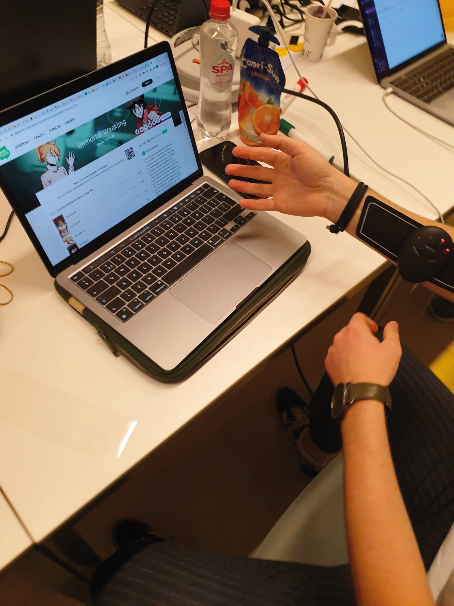
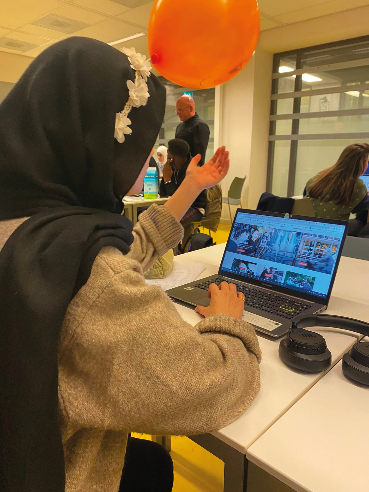
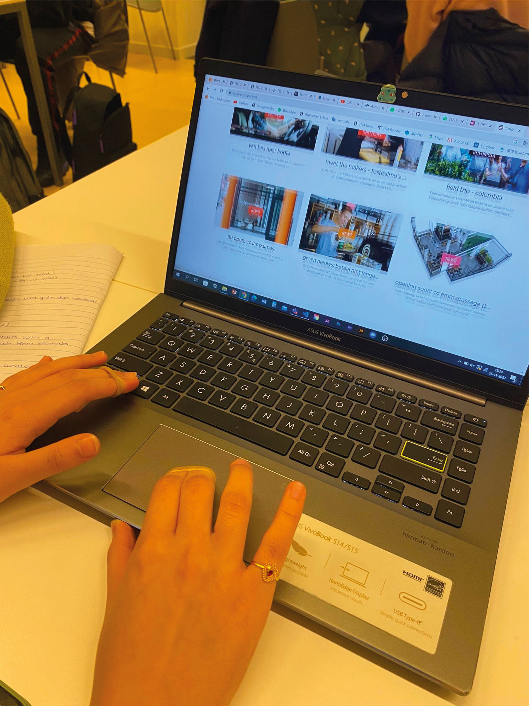
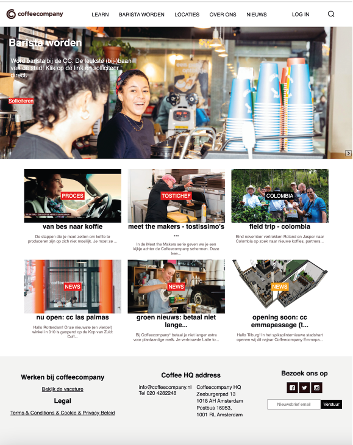
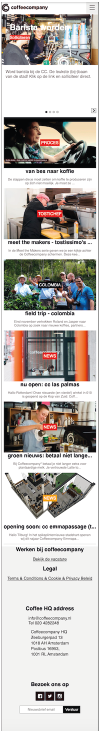
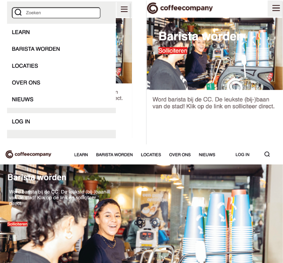
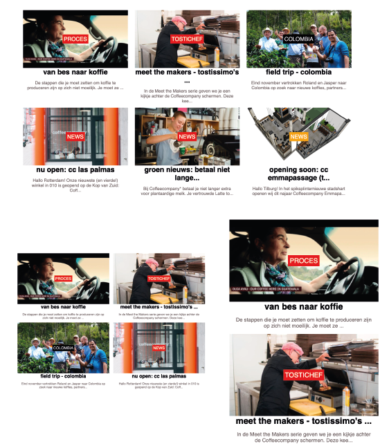
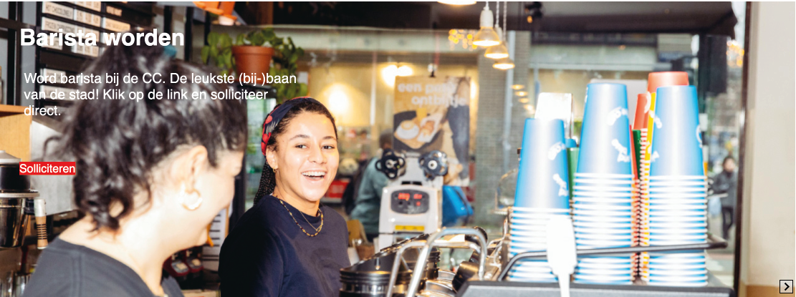

# Procesverslag
Markdown is een simpele manier om HTML te schrijven.  
Markdown cheat cheet: [Hulp bij het schrijven van Markdown](https://github.com/adam-p/markdown-here/wiki/Markdown-Cheatsheet).

Nb. De standaardstructuur en de spartaanse opmaak van de README.md zijn helemaal prima. Het gaat om de inhoud van je procesverslag. Besteedt de tijd voor pracht en praal aan je website.

Nb. Door *open* toe te voegen aan een *details* element kun je deze standaard open zetten. Fijn om dat steeds voor de relevante stuk(ken) te doen.

## Jij

  
uitwerken voor kick-off werkgroep

  ### Auteur:
  Bart Spons

  #### Je startniveau:
  Rood

  #### Je focus:
  responsive plane
 

## Je website

  
uitwerken voor kick-off werkgroep

  ### Je opdracht:
  https://coffeecompany.nl/

  #### Screenshot(s) van de eerste pagina (small screen): 
  Coffeecompany 
  
  

  #### Screenshot(s) van de tweede pagina (small screen):
  coffeecompany -> locaties  
  
 

## Toegankelijkheidstest 1/2 (week 1)

  
uitwerken na test in 1e werkgroep

  ### Bevindingen
  Lijst met je bevindingen die in de test naar voren kwamen:
  - 

  #### Screenreader
  Hier korte omschrijving (met indien nodig afbeeldingen)
  
  - De screenreader doet er leest alle links voor die te zien zijn op de mobiele versie ongeacht hoe groot je beeldscherm is. Je ziet op 1200px breedte niet dat er submenu's zijn. Deze worden wel voorgelezen, dit is natuurlijk in eerste instantie heel gek. Voor een blinde is het natuurlijk logisch dat hij/zij deze opties te horen krijgt.
  

  Hier een omschrijving van hoe het opgelost kan worden (met indien nodig afbeeldingen)
  
  - De submenu's zowel laten zien op 1200px als op kleiner formaat. Dat voor zowel blinde als niet blinde gebruikers hier geen verwarring kan ontstaan.
  
  

  #### Muis en Toetsenbord 
  Hier korte omschrijving (met indien nodig afbeeldingen)

  -  Alleen toetsenbord, scrollen met de pijltjes is goed te doen. De tab werkt niet zoals verwacht. Zodra je in de submenu's komt zie je niet meer waar de tab is. Na ongeveer 10 keer op tab te duwen komt deze weer tevoorschijn op het scherm.

  Hier een omschrijving van hoe het opgelost kan worden (met indien nodig afbeeldingen)
  
  - De submenu's zowel laten zien op 1200px als op kleiner formaat. Dat voor de gebruikers hier geen verwarring kan ontstaan.
  
  

  #### Motoriek (shocks, elastiekjes)
  Hier korte omschrijving:
  
  - Gebruik gemaakt van elastiekjes en een ballon. Elastiekjes was nog te doen omdat het een website was met niet te veel informatie waardoor het overzichtelijk is. De website bedienen met schock was over het algemeen nog wel te doen, alleen de kleine icoontjes zoals in de footer waren moeilijk te bedienen. 

  
  
  

  Hier een omschrijving van hoe het opgelost kan worden:
  
  - Zoveel mogelijk informatie op een pagina zetten zodat de gebruiker minder vaak moet doorklikken op de website.
 

  #### Visueel (brillen, contrast, kleurenblind, dark/light). 
  Hier korte omschrijving (met indien nodig afbeeldingen)
  
  - Ik heb onder andere kleurenblindheid getest. Mij viel op de de website heel veel rood en zwart bevat. Deze twee kleuren gaat niet goed samen voor kleurenblinden. 
  
  Hier een omschrijving van hoe het opgelost kan worden (met indien nodig afbeeldingen)
  
  - Als het bedrijf rekening wilt houden met kleurenblinden zullen ze een andere kleurencombinatie moeten bedenken in plaats van fel rood en zwart.

## Breakdownschets (week 1)

  
uitwerken na afloop 2e werkgroep

  ### de hele pagina: 
  

  ### dynamisch deel (bijv menu): 
  
  

  ### wellicht nog een dynamisch deel (bijv filter): 
  

## Voortgang 1 (week 2)

  
uitwerken voor 1e voortgang

  ### Stand van zaken
  Section verdeling ging goed
  
  - 2e section in main ging goed, juiste volgorde volgens de html regels is gelukt.
  
  - slider maken was moeilijk, dit was nieuw voor mij
  
  - Footer netjes maken is lastig

  ### Agenda voor meeting
  samen met je groepje opstellen

  | student 1      | student 2          | student 3    | student 4        |
  | ---            | ---                | ---          | ---              |
  | dit bespreken  | en dit             | en ik dit    | en dan ik dat    |
  | en dat ook nog | dit als er tijd is | nog een punt | dit wil ik zeker |
  | ...            | ...                | ...          | ...              |

  ### Verslag van meeting
  hier na afloop snel de uitkomsten van de meeting vastleggen

  - 
  - punt 2
  - nog een punt
  - ...

## Voortgang 2 (week 3)

  
uitwerken voor 2e voortgang

  ### Stand van zaken
  
  - tekst op slider
  - Footer gemaakt, middelste section is nog niet goed. De twee ul staan onder elkaar en moeten naast elkaar komen te staan.
  - Header is nog leeg

  ### Agenda voor meeting
  samen met je groepje opstellen

  | Ruben van Vliet      | Ruud Jansen          | Bart Spons    |
  | ---            | ---                | ---          | ---              |
  | dit bespreken  | en dit             | en ik dit    | en dan ik dat    |
  | en dat ook nog | dit als er tijd is | nog een punt | dit wil ik zeker |
  | ...            | ...                | ...          | ...              |

  ### Verslag van meeting
  hier na afloop snel de uitkomsten van de meeting vastleggen

  - Responsive moet nog
  - Tweede pagina moet nog
  - Hamburgermenu moet nog
  - Hover moet nog

## Toegankelijkheidstest 2/2 (week 4)

  
uitwerken na test in 8e werkgroep

  ### Bevindingen
  Lijst met je bevindingen die in de test naar voren kwamen (geef ook aan wat er verbeterd is):

  #### Screenreader
  De kopjes waren prima te bedienen met de screanreader. De links zijn allemaal prima te horen, ook het hamburgermenu wordt mooi meegenomen door de screanreader.

  #### Muis en Toetsenbord 
  Het hamburgermenu is lastig te bedienen met muis en toetsenbord.

  #### Motoriek (shocks, elastiekjes)
  De website is overzichtelijk en prima te lezen met de shock. Als je de website wilt bedienen zijn de kleine links onderaan de footer lastig op te klikken aangezien je vingers aan het trillen zijn door het shock apparaat.

  #### Visueel (brillen, contrast, kleurenblind, dark/light). 
  Door de felle kleur rood is de website door de meeste brillen goed te onderscheiden van de rest.

## Voortgang 3 (week 4)

  
uitwerken voor 3e voortgang

  ### Stand van zaken
  Slider ging moeizaam, de tekst die erop staat veranderd nog niet als er een afbeelding veranderd.
  Header is bijna helemaal bijgewerkt. Zowel voor desktop versie als voor mobiel formaat.

  ### Agenda voor meeting
  samen met je groepje opstellen

  | Ruben          | Ruud               | Bart         | 
  | ---            | ---                | ---          | 
  |- Link zoekbalk | - Tekst in een grid| - een slider | 
  |- Orderen valk  | Alleen horizontaal | - Menu balk  |
  |                | - Aparte body      | - tekst op slider| 

  ### Verslag van meeting
  hier na afloop snel de uitkomsten van de meeting vastleggen

  - Tekst/elementen beter stijlen doormiddel van grid
  - Flexbox verbeteren/ elementen verplaatsen
  - Links naar andere positie op een website
  - Opmaak voor de slider

## Eindgesprek (week 5)

  
uitwerken voor eindgesprek

  ### Je uitkomst - karakteristiek screenshots:
  
  

  ### Dit ging goed/Heb ik geleerd: 
  Korte omschrijving met plaatjes:
  - Ik ben heel blij met mijn navigatie balk. Beide lijken op de menubalk van de originele website. Het hamburger menu die uitklapt over een deel van de pagina en de desktop versie die elementen links midden en rechts heeft uitgelijnt is ook gelukt.

  

  - Responsive maken van de website was het meeste werk bij de section van de zes kopjes. Deze gaan van drie naar twee naar een kopjes per rij. Hier zit ook een hover op. Dit heb ik allemaal geleerd tijdens de afgelopen weken.

  

  ### Dit was lastig/Is niet gelukt:
  Korte omschrijving met plaatjes

  - De slider vond ik lastig. Als de slider responsive wordt dan gaat de tekst van onder de afbeelding op de afbeelding staan. Dit is mij gelukt maar de perfecte opmaak vond ik lastig. De slider op de echte website van de Coffeecompany is niet volledige breedte. De slider namaken zoals op de website is mij niet helemaal gelukt.

  

## Bronnenlijst

  
continu bijhouden terwijl je werkt

  Nb. Wees specifiek ('css-tricks' als bron is bijv. niet specifiek genoeg).

  1. https://www.geeksforgeeks.org/how-to-place-text-on-image-using-html-and-css/
  2. https://developer.mozilla.org/en-US/docs/Web/CSS/Using_CSS_custom_properties
  3. https://codepen.io/shooft/pen/PoaVxVZ?editors=1010 

